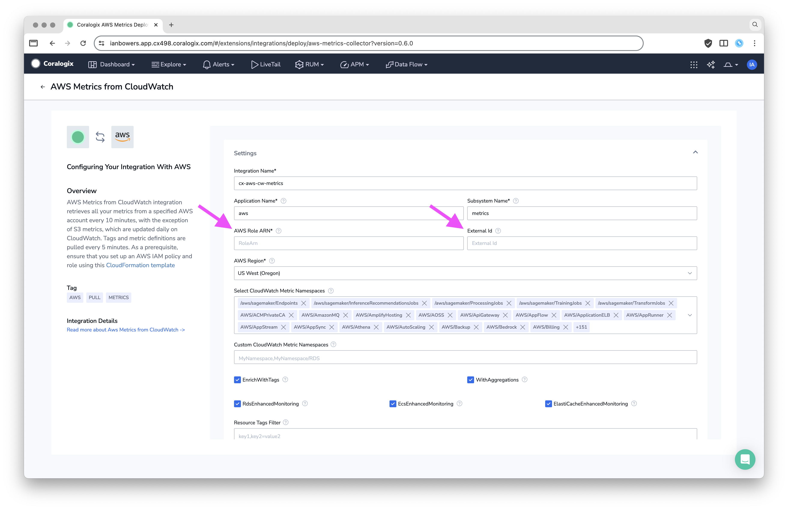

# cloudwatch-metrics-iam-role
This Terraform module provisions an IAM role with an inline policy that allows Coralogix to collect metrics from various AWS resource types.

## Coralogix Integration
The values output by this Terraform module are used with the Coralogix AWS Metrics from CloudWatch integration. See below:


## Documentation
The documentation for this integration can be found here: [https://coralogix.com/docs/integrations/aws/aws-cloudwatch/aws-metrics-via-cloudwatch/](https://coralogix.com/docs/integrations/aws/aws-cloudwatch/aws-metrics-via-cloudwatch/)

## Usage
See `examples` for a complete example.

The value of `external_id_secret` and `coralogix_company_id` will be combined to create the final ExternalId.

For example, these values:
```
 external_id_secret   = "c0r4l0g1x"
 coralogix_company_id = "01234567890"
```

Will be added to a trust policy that contains:
```
"sts:ExternalId": "c0r4l0g1x@01234567890"
```

E.g.,
```
{
    "Version": "2012-10-17",
    "Statement": [
        {
            "Effect": "Allow",
            "Principal": {
                "AWS": "arn:aws:iam::739076534691:role/coralogix-ingestion-us2"
            },
            "Action": "sts:AssumeRole",
            "Condition": {
                "StringEquals": {
                    "sts:ExternalId": "c0r4l0g1x@01234567890"
                }
            }
        }
    ]
}
```


<!-- BEGIN_TF_DOCS -->
## Inputs

| Name | Description | Type | Default | Required |
|------|-------------|------|---------|:--------:|
| <a name="input_coralogix_company_id"></a> [coralogix\_company\_id](#input\_coralogix\_company\_id) | Coralogix company ID, used for security validation. Found in Settings > Send Your Data > Company ID | `string` | n/a | yes |
| <a name="input_coralogix_region"></a> [coralogix\_region](#input\_coralogix\_region) | Location of Coralogix account. | `string` | `"US2"` | no |
| <a name="input_external_id_secret"></a> [external\_id\_secret](#input\_external\_id\_secret) | ExternalIdSecret for sts:AssumeRole. Use a random value. | `string` | n/a | yes |
| <a name="input_role_name"></a> [role\_name](#input\_role\_name) | The name of the AWS IAM Role that will be created. Must be at most 64 characters and may only contain alphanumeric characters and the symbols +, =, ,, ., @, \_, -. | `string` | `"coralogix-aws-metrics-integration-role"` | no |

## Outputs

| Name | Description |
|------|-------------|
| <a name="output_coralogix_metrics_role_arn"></a> [coralogix\_metrics\_role\_arn](#output\_coralogix\_metrics\_role\_arn) | The ARN of the Coralogix AWS Metrics role. |
| <a name="output_external_id"></a> [external\_id](#output\_external\_id) | The external ID used in sts:AssumeRole, computed as <external\_id\_secret>@<coralogix\_company\_id>. |
<!-- END_TF_DOCS -->
