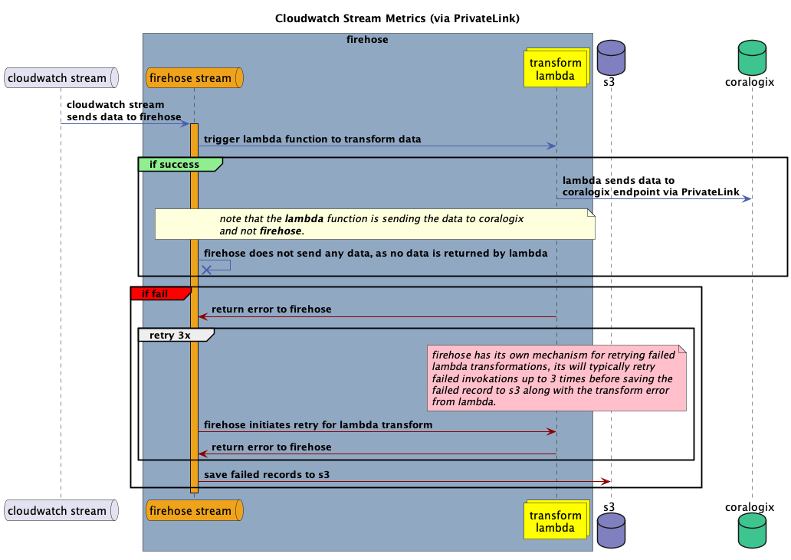

# Forward AWS Logs via Lambda Shipper with Terraform

[//]: # (static-modules-readme-start-description)

## Overview

Our latest AWS integration provides the easiest way to connect with Coralogix. By using a predefined Lambda function, you can seamlessly send AWS logs and events to your Coralogix subscription for detailed analysis, monitoring, and troubleshooting.

[//]: # (/static-modules-readme-start-description)

This integration guide walks you through completing the predefined Lambda function template using Terraform. You’ll need to provide specific configuration parameters based on the service you want to connect. A reference list for these parameters is provided below.


## Requirements

| Name | Version |
|------|---------|
| <a name="requirement_terraform"></a> [Terraform](#requirement\_terraform) | >= 1.7.0 |
| <a name="requirement_aws"></a> [AWS](#requirement\_aws) | >= 2.23 |

## Providers

| Name | Version |
|------|---------|
| <a name="provider_aws"></a> [AWS](#provider\_aws) | >= 4.15.1 |
| <a name="provider_random"></a> [Random](#provider\_random) | >= 3.1.0 |

## Modules

| Name | Version |
|------|---------|
| <a name="module_terraform_aws_modules_lambda_aws"></a> [terraform-aws-modules/lambda/aws](#module\_terraform\_aws\_modules\_lambda\_aws) | >= 3.3.1 |

### Universal configuration

You need to use an existing Coralogix [Send-Your-Data API key](https://coralogix.com/docs/send-your-data-management-api/) to make the connection. Also, make sure your integration is [region-specific](https://coralogix.com/docs/coralogix-domain/). You should always deploy the AWS Lambda function in the same AWS region as your resource (e.g. the S3 bucket).

**Using a single S3 bucket for multiple integrations**

If you're deploying multiple integrations through the same S3 bucket, you'll need to specify parameters for each integration separately using `integration_info`.

!!! note

    If you already have a Lambda function with an S3 trigger set up, this Terraform deployment will remove the trigger. This applies to the following integration types within 
    the same S3 bucket: S3, CloudTrail, VpcFlow, S3Csv, and CloudFront. 
    To prevent this issue, you can explore alternative deployment methods:
    
      -  Deploy the integration using CF Quick Create or SAR, as explained in [this document](https://coralogix.com/docs/coralogix-aws-shipper/).
     
      -  Migrate your existing integrations to Terraform and use the `integration_info` variable.

[//]: # (static-modules-readme-end-description)

| Name | Description | Type | Default | Required |
|------|-------------|------|---------|:--------:|
| <a name="input_coralogix_region"></a> [coralogix\_region](#input\_coralogix\_region) | The Coralogix location region, available options: [`EU1`, `EU2`, `AP1`, `AP2`, `AP3`, `US1`, `US2`, `Custom`] | `string` | n/a | yes |
| <a name="input_custom_domain"></a> [custom_domain](#input\_custom\_domain) | If using a custom domain name for your private cluster, Coralogix will send telemetry from the specified address (e.g. custom.coralogix.com). There is no need to add `ingress.` to the domain.| `string` | n/a | no |
| <a name="input_integration_type"></a> [integration_type](#input\_data\_type) | The AWS service to integrate with Coralogix. Possible values: S3, CloudTrail, VpcFlow, CloudWatch, S3Csv, SNS, SQS, Kinesis, CloudFront, MSK, Kafka, EcrScan. | `string` | `S3` | yes |
| <a name="input_api_key"></a> [api\_key](#input\_api_\_key) | The Coralogix Send Your Data - [API key](https://coralogix.com/docs/send-your-data-api-key/) validates your authenticity. This value can be a direct Coralogix API key or an AWS secret manager ARN containing the API key.| `string` | n/a | yes |
| <a name="input_store_api_key_in_secrets_manager"></a> [store\_api\_key\_in\_secrets\_manager](#input\_store\_api\_key\_in\_secrets\_manager) | Enable this to store your API key securely. Otherwise, it will remain exposed in plain text as an environment variable in the Lambda function console.| bool | true | no |
| <a name="application_name"></a> [application\_name](#input\_application\_name) | The [name](https://coralogix.com/docs/application-and-subsystem-names/) of your application. For a dynamic value, use `$.my_log.field`. This option is not supported since version `1.1.0` for the [source code](https://github.com/coralogix/coralogix-aws-shipper/blob/master/CHANGELOG.md) | string | n\a | yes | 
| <a name="subsystem_name"></a> [subsystem\_name](#input\_subsysten_\_name) | The [name](https://coralogix.com/docs/application-and-subsystem-names/) of your subsystem. For a dynamic value, use `$.my_log.field` for CloudWatch log group leave empty. This option is not supported since version `1.1.0` for the [source code](https://github.com/coralogix/coralogix-aws-shipper/blob/master/CHANGELOG.md) | string | n\a | yes |

[//]: # (/static-modules-readme-end-description)

[//]: # (description id="S3-integration" title="AWS Shipper Terraform Module for S3 Integration" examples_path="examples/coralogix-aws-shipper/README.md")

### S3, CloudTrail, Vpc Flow, S3Csv configuration

| Name | Description | Type | Default | Required |
|------|-------------|------|---------|:--------:|
| <a name="input_s3_bucket_name"></a> [s3\_bucket\_name](#input\_s3\_bucket\_name) | Comma separated list of the names for the S3 bucket to watch. | `string` | n/a | yes |
| <a name="input_s3_key_prefix"></a> [s3\_key\_prefix](#input\_s3\_key\_prefix) | The S3 path prefix to watch. | `string` |  n/a | no |
| <a name="input_s3_key_suffix"></a> [s3\_key\_suffix](#input\_s3\_key\_suffix) | The S3 path suffix to watch. | `string` |  n/a | no |
| <a name="input_s3_bucket_kms_arn"></a> [s3\_bucket\_kms\_arn](#input\_s3\_bucket\_kms\_arn) | The AWS ARN of the KMS key used to encrypt/decrypt objects in the specified S3 bucket. If provided, the Lambda policy will include permissions to decrypt using this key. | `string` |  n/a | no |
| <a name="input_csv_delimiter"></a> [csv_delimiter](#input\_csv\_delimiter) | A single character to be used as a delimiter when ingesting a CSV file with a header line. This value is applicable when the S3Csv integration type is selected, for example, “,” or ” “.  | `string` |  n/a | no |
| <a name="input_custom_csv_header"></a> [custom\_csv\_header](#input\_custom\_csv\_header) | List seperated by cs delimiter of a new headers for your csv, the variable must be with the same delimiter as the cs_delimiter. For example, if the cs_delimiter is \";\", then the variable vakue should be name;country;age, resulting in the following new headers in Corlaogix: name, country, age | `string` | n/a | no |
| <a name="input_newline_pattern"></a> [newline\_pattern](#input\_newline\_pattern) | A regular expression to detect a new log line for multiline logs, e.g., \n(?=\d{2}-\d{2}\s\d{2}:\d{2}:\d{2}.\d{3}). | `string` | n/a | no |
| [integration_info](#additional-parameters-for-integration_info) | A map of integration information. Use this to deploy multiple integrations using the same s3 bucket. See the integration [parameters](#integration_info).| `mapping` | n/a | no |

### Additional parameters for `integration_info`

| Name | Description | Type | Default | Required | 
|------|-------------|------|---------|:--------:|
| <a name="input_integration_type"></a> [integration_type](#input\_data\_type) | The AWS service to integrate with Coralogix. Possible values: S3, CloudTrail, VpcFlow, S3Csv, CloudFront. | `string` | n/a | yes |
| <a name="input_api_key"></a> [api\_key](#input\_api_\_key) | The Coralogix Send Your Data - [API key](https://coralogix.com/docs/send-your-data-api-key/) validates your authenticity. This value can be a direct Coralogix API key or an AWS secret mManager ARN containing the API key.| `string` | n/a | yes |
| <a name="input_store_api_key_in_secrets_manager"></a> [store\_api\_key\_in\_secrets\_manager](#input\_store\_api\_key\_in\_secrets\_manager) | Enable this to store your API key securely. Otherwise, it will remain exposed in plain text as an environment variable in the Lambda function console.| bool | true | no |
| <a name="application_name"></a> [application\_name](#input\_application\_name) | The [name](https://coralogix.com/docs/application-and-subsystem-names/) of your application. For dynamic values, refer to [Metadata](#metadata) | string | n\a | yes | 
| <a name="subsystem_name"></a> [subsystem\_name](#input\_subsysten_\_name) | The [name](https://coralogix.com/docs/application-and-subsystem-names/) of your subsystem. For dynamic values, refer to [Metadata](#metadata) | string | n\a | yes |
| <a name="lambda_log_retention"></a> [lambda_log_retention](#lambda\_log\_retention) | The CloudWatch log retention period (in days) for logs generated by the Lambda function. | `number` | 5 | no |
| <a name="input_lambda_name"></a> [lambda\_name](#input\_lambda\_name) | Name of the Lambda function that you want to create. | `string` | n/a | no |
| <a name="input_s3_key_prefix"></a> [s3\_key\_prefix](#input\_s3\_key\_prefix) | The S3 path prefix to watch. | `string` |  n/a | no |
| <a name="input_s3_key_suffix"></a> [s3\_key\_suffix](#input\_s3\_key\_suffix) | The S3 path suffix to watch. | `string` |  n/a` | no |
| <a name="input_newline_pattern"></a> [newline\_pattern](#input\_newline\_pattern) | A regular expression to detect a new log line for multiline logs, e.g., \n(?=\d{2}-\d{2}\s\d{2}:\d{2}:\d{2}.\d{3}). | `string` | n/a | no |

[//]: # (/description)

[//]: # (description id="CloudWatch-integration" title="AWS Shipper Terraform Module for CloudWatch Integration" examples_path="examples/coralogix-aws-shipper/README.md")

### CloudWatch configuration

| Name | Description | Type | Default | Required | 
|------|-------------|------|---------|:--------:|
| <a name="input_log_groups"></a> [log\_groups](#input\_log\_groups) | A comma-separated list of CloudWatch log group names to monitor. For example, (log-group1, log-group2, log-group3). | `list(string)` | n/a | yes |
| <a name="input_log_group_prefix"></a> [log\_group\_prefix](#input\_log\_group\_prefix) |  list of strings of log group prefixes. The code will use these prefixes to create permissions for the Lambda instead of creating for each log group permission it will use the prefix with a wild card to give the Lambda access for all of the log groups that start with these prefix. This parameter doesn't replace the `log_groups` parameter.  For more information, refer to the Note below. | `list(string)` | n/a | no |

!!! note

The `log_group` variable will get a list of log groups and then add them to the Lambda as triggers, each log group will also add permission to the Lambda, in some cases when there are a lot of log groups this will cause an error because the code 
tries to create too many permissions for the Lambda (AWS have a limitation for the number of permission that you can have for a Lambda), and this is why we have the `log_group_prefix` parameter, this parameter will add **only** permission to the Lambda using a wildcard( * ).

for example, in case I have the log groups: log1,log2,log3 instead that the code will create for each of the log group permission to trigger the shipper Lambda then you can set `log_group_prefix = ["log"]`, and then it will create only 1 permission for all of the log groups to trigger the shipper Lambda, but you will still need to set `log_groups = ["log1","log2","log3"]`. When using this parameter, you will not be able to see the log groups as triggers for the Lambda.

If you need to add multiple log groups to the Lambda function using regex, refer to our [Lambda manager](https://github.com/coralogix/terraform-coralogix-aws/tree/master/modules/lambda-manager)


[//]: # (/description)

[//]: # (description id="SNS-integration" title="AWS Shipper Terraform Module for SNS Integration" examples_path="examples/coralogix-aws-shipper/README.md")

### SNS configuration

| Name | Description | Type | Default | Required | 
|------|-------------|------|---------|:--------:|
| <a name="input_sns_topic_name"></a> [sns_topic_name](#input\_sns\_topic\_name) | The SNS topic containing the SNS subscription. You need this only when using the SNS integration. | `string` |  n/a | yes |
| <a name="input_sns_topic_filter"></a> [sns_topic_filter](#input\_sns\_topic\_filter) | Map of filters to add to the SNS topic Lambda subscription. | `map(any)` |  n/a | no |
| <a name="input_sns_topic_filter_policy_scope"></a> [sns_topic_filter_policy_scope](#input\_sns\_topic\_filter\_policy\_scope) | The scope of the filter policy for the SNS topic Lambda subscription, could be `MessageAttributes` or `MessageBody` | `string` |  n/a | no |

[//]: # (/description)

[//]: # (description id="SQS-integration" title="SQS Integration" examples_path="examples/coralogix-aws-shipper/README.md")
### SQS configuration

| Name | Description | Type | Default | Required | 
|------|-------------|------|---------|:--------:|
| <a name="input_sqs_name"></a> [sqs_name](#input\_sqs\_name) | The name of the SQS queue to which you want to subscribe for retrieving messages.| `string` |  n/a | yes |

[//]: # (/description)

[//]: # (description id="Kinesis-integration" title="AWS Shipper Terraform Module for Kinesis Integration" examples_path="examples/coralogix-aws-shipper/README.md")
### Kinesis configuration

| Name | Description | Type | Default | Required | 
|------|-------------|------|---------|:--------:|
| <a name="input_kinesis_stream_name"></a> [kinesis_stream_name](#input\_Kinesis_\_stream_\_name) | The name of the Kinesis stream to which you want to subscribe for retrieving messages.| `string` |  n/a | yes |

[//]: # (/description)

[//]: # (description id="MSK-integration" title="AWS Shipper Terraform Module for MSK Integration" examples_path="examples/coralogix-aws-shipper/README.md")

### MSK configuration

| Name | Description | Type | Default | Required | 
|------|-------------|------|---------|:--------:|
| <a name="input_msk_cluster_arn"></a> [msk_cluster_arn](#input\_msk\_cluster\_arn) | The ARN of the MSK cluster to subscribe to retrieving messages.| `string` |  n/a | yes |
| <a name="input_msk_topic_name"></a> [msk_topic_name](#input\_msk\_topic\_name) | List of The Kafka topic names used to store records in your Kafka cluster [\"topic-name1\" ,\"topic-name2\"].| `list of strings` |  n/a | yes |

[//]: # (/description)

[//]: # (description id="Kafka-integration" title="AWS Shipper Terraform Module for Kafka Integration" examples_path="examples/coralogix-aws-shipper/README.md")

### Kafka configuration

| Name | Description | Type | Default | Required | 
|------|-------------|------|---------|:--------:|
| <a name="input_kafka_brokers"></a> [kafka_brokers](#input\_kafka\_brokers) | Comma-delimited list of Kafka broker to connect to.| `string` |  n/a | yes |
| <a name="input_kafka_topic"></a> [kafka_topic](#input\_kafka\_topic) | The Kafka topic to subscribe to.| `string` |  n/a | yes |
| <a name="input_kafka_subnets_ids"></a> [kafka_subnets_ids](#input\_kafka\_subnets\_ids) | List of Kafka subnets to use when connecting to Kafka.| `list` |  n/a | yes |
| <a name="input_kafka_security_groups"></a> [kafka_security_groups](#input\_kafka\_security\_groups) | List of Kafka security groups to use when connecting to Kafka.| `list` |  n/a | yes |

[//]: # (/description)

### Generic configuration (optional)

| Name | Description | Type | Default | Required | 
|------|-------------|------|---------|:--------:|
| <a name="input_custom_metadata"></a> [custom\_metadata](#input\_custom\_metadata) | Custom metadata to be added to the log message in the comma-separated format. Options are: `key1=value1,key2=value2` | `string` | n/a | no |
| <a name="input_add_metadata"></a> [add\_metadata](#input\_add\_metadata) | Custom metadata to be added to the log message in the comma-separated format. The S3 options are: `bucket_name`,`key_name`. For CloudWatch `stream_name`, `loggroup_name`. For Kafka/MSK, use `topic_name` | `string` | n/a | no |
| <a name="input_lambda_name"></a> [lambda\_name](#input\_lambda\_name) | The name the Lambda function to create. | `string` | n/a | no |
| <a name="input_blocking_pattern"></a> [blocking\_pattern](#input\_blocking\_pattern) | A regular expression to identify lines excluded from being sent to Coralogix. For example, use `MainActivity.java:\d{3}` to match log lines with MainActivity followed by exactly three digits. | `string` | n/a | no |
| <a name="input_sampling_rate"></a> [sampling\_rate](#input\_sampling\_rate) | A message rate, such as 1 out of every N logs. For example, if your value is 10, a message will be sent for every 10th log. | `number` | `1` | no |
| <a name="input_notification_email"></a> [notification_email](#input\_notification\_email) | A failure notification to be sent to the email address. | `string` |  n/a | no |
| <a name="input_custom_s3_bucket"></a> [custom\_s3\_bucket](#input\_custom\_s3\_bucket) | The name of an existing S3 bucket in your region, in which the Lambda zip code will be uploaded to. | `string` | n/a | no |
| <a name="input_govcloud_deployment"></a> [govcloud\_deployment](#input\_govcloud\_deployment) | Enable if you deploy the integration in govcloud | `bool` | false | no |

**Custom S3 bucket**

Use the `custom_s3_bucket` variable only when deploying the integration in an AWS region where CX does not provide a public bucket (e.g., GovCloud). When using this variable, you must create an S3 bucket in the desired region for the integration. After that, pass the bucket name as `custom_s3_bucket`. The module will download the integration file to your local workspace, upload it to the custom_s3_bucket, and then remove the file from your local workspace once the process is complete.

When using this variable you will need to create an S3 bucket in the region where you want to run the integration. Then, pass this bucket name as `custom_s3_bucket`. The module will download the integration file to your local workspace, and then upload these files to the `custom_s3_bucket`. At the end, remove the file from your local workspace once the process is complete. 

### Lambda configuration (optional)

| Name | Description | Type | Default | Required | 
|------|-------------|------|---------|:--------:|
| <a name="input_memory_size"></a> [memory\_size](#input\_memory\_size) | The memory size limit for the Lambda function in megabytes. | `number` | `1024` | no |
| <a name="input_timeout"></a> [timeout](#input\_timeout) | The timeout limit for the Lambda function in seconds. | `number` | `300` | no |
| <a name="input_tags"></a> [tags](#input\_tags) | The tag map to all resources. | `map(string)` |  n/a | no |
| <a name="lambda_log_retention"></a> [lambda_log_retention](#lambda\_log\_retention) | The CloudWatch log retention period (in days) for logs generated by the Lambda function. | `number` | 5 | no |
| <a name="log_level"></a> [log_level](#input\_log\_level) |The log level for the Lambda function. Possible values: INFO, WARN, ERROR, DEBUG. | `string` | INFO | no |
| <a name="cpu_arch"></a> [cpu_arch](#input\_cpu\_arch) | Lambda function CPU architecture: arm64 or x86_64. | `string` | arm64 | no |
| <a name="runtime"></a> [runtime](#input\_runtime) | Lambda function runtime. For example, 'provided.al2023', 'provided.al2'. | `string` | provided.al2023 | no |
| <a name="reserved_concurrent_executions"></a> [reserved_concurrent_executions](#input\_reserved_concurrent_executions) | The number of concurrent executions reserved for the function. Leave empty to let Lambda use unreserved account concurrency.	 | `number` | n/a | no |
| <a name="execution_role_name"></a> [execution_role_name](#input\_execution_role_name) | The ARN of a user defined role be used as the execution role for the Lambda function. | `string` | n/a | no |
| <a name="lambda_assume_role_arn"></a> [lambda_assume_role_arn](#input\_lambda_assume_role_arn) | A role that the Lambda will assume. Leave empty to use the default permissions. Note that if this parameter is used, all S3 and ECR API calls from the Lambda will be made with the permissions of the assumed role. | `string` | n/a | no |
| <a name="source_code_version"></a> [source_code_version](#input\_source_code_version) | The version of the source code that the Lambda will use. Must be in `x.x.x` format. The oldest supported version is `1.0.8`. For more information about each version changes, see [Changelog](https://github.com/coralogix/coralogix-aws-shipper/blob/master/CHANGELOG.md). By default, the Lambda will use the latest version. | `string` | n/a | no |


### Metadata

The metadata features decribed below are only available in `coralogix-aws-shipper v1.1.0` and later.
The `add_metadata` parameter allows you to add metadata to the log message. The metadata is added to the log message as a JSON object. The metadata is specific to the integration type. For example, for S3, the metadata is `s3.object.key` and `s3.bucket`. For CloudWatch, the metadata is `cw.log.group` and `cw.log.stream`. See the table below for full metadata list.

| Integration Type | Metadata Key             | Description                           |
|------------------|--------------------------|---------------------------------------|
| S3               | s3.bucket                | The name of the S3 bucket             |
| S3               | s3.object.key            | The key/path of the S3 object         |
| CloudWatch       | cw.log.group             | The name of the CloudWatch log group  |
| CloudWatch       | cw.log.stream            | The name of the CloudWatch log stream |
| Cloudwatch       | cw.owner                 | The owner of the log group            |
| Kafka            | kafka.topic              | The name of the Kafka topic           |
| MSK              | kafka.topic              | The name of the Kafka topic           |
| Kinesis          | kinesis.event.id         | The Kinesis event ID                  |
| Kinesis          | kinesis.event.name       | The Kinesis event name                |
| kinesis          | kinesis.event.source     | The Kinesis event source              |
| kinesis          | kinesis.event.source_arn | The Kinesis event source ARN          |
| Sqs              | sqs.event.source         | The SQS event source/queue            |
| Sqs              | sqs.event.id             | The SQS event ID                      |
| Ecr              | ecr.scan.id              | The EXR scan ID                       |
| Ecr              | ecr.scan.source          | The ECR scan source                   |

!!! note

    The metadata is not added by default. You must specify the metadata keys in the `add_metadata` parameter.
    For example, to add the bucket name and key name to the log message, set the `add_metadata` parameter to `s3.object.key,s3.bucket`.
    Some metadata keys will overlap as some integrations share the same metadata. For example, both Kafka and MSK have the same metadata key `kafka.topic` or both Kinesis and Cloudwatch metadata will be 
    added in cases where a Cloudwatch log stream is being ingested from a Kinesis stream.

##### Dynamic subsystem or application name

As of `v1.1.0` for the source code, you can use dynamic values for the application and subsystem name parameters based on the internal metadata defined above.
To do accomplish this, use the following syntax:
```
{{ metadata.key | r'regex' }}
```
For example, to use the bucket name as the subsystem name, set the `subsystem_name` parameter to:
```
{{ s3.bucket }}
```
If to use the log group name as the application name, set the `application_name` parameter to:
```
{{ cw.log.group }}
```
To use a part of the metadata value, use a regular expression to extract the desired part. For example, if we have an `s3.object.key` value of `AWSLogs/112322232/ELB1/elb.log` and we want to extract the last part of the key as the subsystem name, we would set the `subsystem_name` parameter to:
```
{{ s3.object.key | r'AWSLogs\\/.+\\/(.*)$' }}
```
This would result in a SubsystemName value of `elb.log` as this is the part of the regex captured by the group `(.*)`.

!!! important

    - The regex must be a valid regex pattern.
    - The regex must define a capture group for part of the string you want to use as the value
    - The metadata key must exist in the list defined above and be a part of the integration type that is deployed.
    
Dynamic values are only supported for the `application_name` and `subsystem_name` parameters, the `custom_metadata` parameter is not supported.

To use a json key value as the application name, set the `application_name` parameter to:
```
{{ $.json_key_path }}
```
If you are sending this json log to the shipper:
```
"json_log" : {
  {
    "application_key": "application_value"
  }
}
```
Set the `application_name` parameter to:
```
{{ $.json_log.application_key }}
```
Then, the application name value will be `application_value`.

### VPC configuration (optional)

| Name | Description | Type | Default | Required | 
|------|-------------|------|---------|:--------:|
| <a name="input_subnet_ids"></a> [vpc\_subnet\_ids](#input\_subnet\_ids) | The ID of the subnet where the integration will be deployed. | `list(string)` | n/a | no |
| <a name="input_security_group_ids"></a> [security\_group\_ids](#input\_security\_group\_ids) | The ID of the security group where the integration will be deployed. | `list(string)` | n/a | no |
| <a name="input_create_endpoint"></a> [security\_create\_endpoint](#input\_create\_endpoint) | Set to `true` if you store your ApiKey in a secret (you can have only one of this endpoints per region) | `bool` | false | no |

### DLQ

A Dead Letter Queue (DLQ) is a queue where messages are sent if they cannot be processed by the Lambda function. This is useful for debugging and monitoring.

 To enable the DLQ, provide the required parameters listed below.

| Parameter       | Description                                                                   | Default Value | Required |
|-----------------|-------------------------------------------------------------------------------|---------------|----------|
| enable_dlq      | Enable the Dead Letter Queue for the Lambda function.                         | false         | yes      |
| dlq_s3_bucket   | An S3 bucket used to store all failure events that have exhausted retries.    |               | yes      |
| dlq_retry_limit | The number of times a failed event to be retried before being saved in S3     | 3             | yes      |
| dlq_retry_delay | The delay in seconds between retries of failed events                         | 900           | yes      |

**AWS PrivateLink**

If you want to bypass using the public internet, you can use AWS PrivateLink to facilitate secure connections between your VPCs and AWS services. This option is available under [VPC Configuration](#vpc-configuration-optional). For additional instructions on AWS PrivateLink, [follow our dedicated tutorial](https://coralogix.com/docs/coralogix-amazon-web-services-aws-privatelink-endpoints/).


### Cloudwatch metrics streaming via PrivateLink (beta)

As of [Lambda source code version](https://github.com/coralogix/coralogix-aws-shipper) `v1.3.0` and Terraform module version `v2.6.0`, the Coralogix AWS Shipper supports streaming **Cloudwatch metrics to Coralogix via Firehose over a PrivateLink**.

This workflow is designed for scenarios where you need to stream metrics from a CloudWatch metrics stream to Coralogix via a PrivateLink endpoint.

#### Why to use this workflow

AWS Firehose does not support PrivateLink endpoints as a destination because Firehose cannot be connected to a VPC, which is required to reach a PrivateLink endpoint. To overcome this limitation, the Coralogix AWS Shipper acts as a transform function. It is attached to a Firehose instance that receives metrics from the CloudWatch metrics stream and forwards them to Coralogix over a PrivateLink.

#### When to use this workflow

This workflow is designed to bypass the limitations of using Firehose with the Coralogix PrivateLink endpoint. If PrivateLink is not required, we recommend using the default Firehose integration for CloudWatch Stream Metrics, available [here](https://coralogix.com/docs/integrations/aws/amazon-data-firehose/aws-cloudwatch-metric-streams-with-amazon-data-firehose/).

#### How does it work?



To enable CloudWatch metrics streaming via Firehose (PrivateLink), you must provide the necessary parameters listed below.

| Parameter | Description | Default Value | Required |
|-----------|-------------|---------------|--------------------|
| telemetry_mode | Specify the telemetry collection modes, supported values (`metrics`, `logs`). Note that this value must be set to `metrics` for the Cloudwatch metric stream workflow | logs. | :heavy_check_mark: |
| api_key | The Coralogix Send Your Data - [API key](https://coralogix.com/docs/send-your-data-api-key/) validates your authenticity. This value can be a direct Coralogix API key or an AWS secret manager ARN containing the API key.| `string` | n/a | yes |
| application_name | The name of the application for which the integration is configured. [Metadata](#metadata) specifies dynamic value retrieval options. | string | n\a | yes | 
| subsystem_name | The name of your subsystem. For a dynamic value, refer to the [Metadata](#metadata) section. For CloudWatch, leave this field empty to use the log group name. | string | n\a | yes |
| coralogix_region | The Coralogix location region, possible options are [`EU1`, `EU2`, `AP1`, `AP2`, `AP3`, `US1`, `US2`, `Custom`] | `string` | n/a | yes |
| s3_bucket_name | The S3 bucket to be used to store records that have failed processing. | | :heavy_check_mark: |
| subnet_ids | The ID of the subnet for the integration deployment. | `list(string)` | n/a | :heavy_check_mark: |
| security_group_ids | The ID of the security group for the integration deployment. | `list(string)` | n/a | :heavy_check_mark: |
| include_metric_stream_filter | List of inclusive metric filters. If you specify this parameter, the stream sends only the conditional metric names from the specified metric namespaces. Leave empty to send all metrics | `llist(object({namespace=string, metric_names=list(string)})` | n/a | |

The include_metric_stream_filter example:
```
module "coralogix_aws_shipper" "coralogix_firehose_metrics_private_link" {
  source = "coralogix/aws-shipper/coralogix"
  telemetry_mode = "metrics"
  api_key = <your private key>
  application_name = "application_name"
  subsystem_name = "subsystem_name"
  coralogix_region = <coralogix region>
  s3_bucket_name = <s3 bucket name>
  subnet_ids = <subnet ids>
  security_group_ids = <security group ids>

  include_metric_stream_filter = [
    {
      namespace    = "AWS/EC2"
      metric_names = ["CPUUtilization", "NetworkOut"]
    },
    {
      namespace    = "AWS/S3"
      metric_names = ["BucketSizeBytes"]
    },
  ]
}
```

## Outputs

| Name | Description |
|------|-------------|
| <a name="output_lambda_function_arn"></a> [lambda\_function\_arn](#output\_lambda\_function\_arn) | The ARN of the Lambda function. |
| <a name="output_lambda_function_name"></a> [lambda\_function\_name](#output\_lambda\_function\_name) | The name of the Lambda function. |
| <a name="output_lambda_role_arn"></a> [lambda\_role\_arn](#output\_lambda\_role\_arn) | The ARN of the IAM role created for the Lambda function. |
| <a name="output_lambda_role_name"></a> [lambda\_role\_name](#output\_lambda\_role\_name) | The name of the IAM role created for the Lambda function. |
